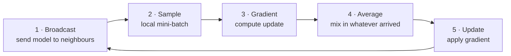

# SWIFT

**Rapid Decentralized Federated Learning via Wait-Free Model Communication**
Marco Bornstein, Tahseen Rabbani, Evan Wang, Amrit Singh Bedi, Furong Huang — *ICLR 2023*

[Paper](https://openreview.net/forum?id=jh1nCir1R3d) · [arXiv:2210.14026](https://arxiv.org/abs/2210.14026)

SWIFT is a decentralized federated learning algorithm in which **no client ever
waits for another**. Each client broadcasts its model to its neighbours, keeps
training, and averages in whatever has arrived by the time it needs it. Slow
clients hold nobody back, which cuts communication time by up to an order of
magnitude against synchronous baselines while matching their final accuracy.

It is the first asynchronous decentralized FL algorithm to reach the optimal
`O(1/√T)` convergence rate without a bounded-delay assumption.

---

## Install

Requires Python 3.10+ and an MPI implementation (Open MPI or MPICH) — `mpi4py`
builds against it.

```bash
# macOS:         brew install open-mpi
# Debian/Ubuntu: sudo apt install libopenmpi-dev openmpi-bin

git clone https://github.com/marcobornstein/SWIFT.git
cd SWIFT
pip install -e .
```

For CUDA, install the matching PyTorch build first (see
[pytorch.org](https://pytorch.org/get-started/locally/)); everything else is
version-agnostic.

## Quickstart

One MPI rank is one federated client. This trains four clients in a ring for
three epochs and downloads CIFAR-10 on the way:

```bash
mpirun -np 4 swift-train --epochs 3 --name hello-swift
```

It runs on CPU, CUDA or Apple Silicon — `--device` defaults to the best
available. Every flag has a default and `swift-train --help` lists them all;
`--print-config` resolves a configuration and exits without training.

## How it works

Each client repeats five steps. Steps 1 and 4 touch the network, and neither
waits on it: the broadcast is non-blocking, and the average takes whatever has
already arrived.



Because a client averages only over messages already in its queue, the mixing
matrix for any single round is neither symmetric nor doubly stochastic. SWIFT's
**Communication Coefficient Selection** protocol (Algorithm 2, implemented in
[`topology.py`](src/swift/topology.py)) chooses weights so that the *expected*
mixing matrix is both — which is what makes the convergence proof go through.
`tests/test_mpi.py` asserts exactly that property on every run.

## Reproducing the paper

`scripts/run_experiment.sh` runs all five algorithms over five seeds for one
config:

```bash
scripts/run_experiment.sh configs/baseline-ring.yaml 16
python tools/summarize.py outputs/baseline-ring     # the Table 3 comparison
python tools/plot.py outputs/baseline-ring --metric test_loss   # the Figure 2 curves
```

`summarize.py` prints mean epoch and communication times per algorithm with the
percentage change against D-SGD, which is what Tables 3-7 report, alongside
`sync` and wall time per epoch — see [Output](#output) for why the last two
matter. `plot.py` draws loss against elapsed minutes with a bootstrapped band
over seeds; it accumulates epoch time by default (the algorithm's own cost, as
in Figures 2, 3 and 6) and `--time-from wall_time` includes straggler delay, as
Figure 4 does.

Each of the paper's experiments maps onto one config:

| Experiment | Paper | Config | Launch |
| --- | --- | --- | --- |
| Baseline comparison | §6.1, Table 3, Fig. 2 | `baseline-ring.yaml` | `-np 16` |
| Varying non-IIDness | §6.2, Table 4, Fig. 3 | `vary-noniid-roc.yaml` | `-np 10 --non-iid {0.25,0.5,0.7,0.9}` |
| Varying heterogeneity | §6.2, Table 5, Fig. 4 | `slowdown-ring.yaml` | `-np 16 --slowdown {1,2,4}` |
| Varying no. of clients | §6.3, Table 6, Fig. 5 | `baseline-ring.yaml` | `-np {2,4,8,16}` |
| Varying topology | §6.3, Table 7, Fig. 6 | `vary-topology-roc.yaml` | `-np 16 --clusters {2,4}` / `--topology ring` |

The hyperparameters in those configs are Table 8 of the paper verbatim:

| Experiment | Model | Epochs | LR | Decay | Batch | Weight decay | Momentum |
| --- | --- | --- | --- | --- | --- | --- | --- |
| Baseline / no. of clients | ResNet-18 | 200 | 0.1 | ×1/10 at 81 & 122 | 32 | 1e-4 | 0.9 |
| Varying non-IIDness | ResNet-18 | 300 | 0.8 | ×1/2 every 10 from 200 | 32 | 1e-4 | 0.9 |
| Varying heterogeneity | ResNet-18 | 100 | 0.1 | ×1/2 every 10 from 50 | 32 | 1e-4 | 0.9 |
| Varying topology | ResNet-50 | 200 | 0.1 | ×1/2 every 10 from 100 | 64 | 1e-4 | 0.9 |

The paper's `C0` rows are `--local-steps 1` and the `C1` (2-SGD) rows are
`--local-steps 2`. On a cluster, `scripts/slurm.sbatch` is a SLURM template.

### Reproducibility

**SWIFT runs are not bit-reproducible, by design.** A client averages whatever
has arrived by the time it needs it, so message timing changes the result: two
runs with the same seed diverge from the first epoch. That is the algorithm, not
a defect, and it is why the paper reports every experiment averaged over five
seeds. Expect run-to-run spread, and compare distributions rather than single
runs. The synchronous baselines exchange with every neighbour on a fixed
schedule and do reproduce exactly.

Everything upstream of the averaging is deterministic given `--seed`: the data
partition, each client's initial model, the batch order, and the held-out
evaluation subset. `--deterministic 1` additionally forces deterministic
kernels, which is slower and does not make SWIFT itself reproducible.

### What a reproduction costs

The paper's runs used one NVIDIA RTX 2080 Ti per client. At the epoch times it
reports (Table 3: 1.0s for SWIFT, 1.6s for D-SGD on 16 clients), a single
200-epoch run is minutes of algorithm time and well under an hour of wall clock
once evaluation is included. `run_experiment.sh` sweeps five algorithms over
five seeds, so budget roughly 25 runs per experiment.

Fewer GPUs than clients works — clients share devices — but the reported epoch
and communication times then measure contention rather than the algorithm, so
the timing tables are only meaningful at one device per client. Loss curves are
unaffected.

CPU-only runs are fine for testing the code and far too slow for the paper's
settings: a single epoch of 16-client ResNet-18 takes minutes rather than a
second. On one node, clients share its cores automatically; set
`OMP_NUM_THREADS` to override.

Leave `--num-workers` at 0. DataLoader workers are forked after MPI has
initialised, which MPI implementations document as unsafe and which hangs with
Open MPI on macOS. It is also what the paper's timings were measured with.

### Algorithms

| `--algorithm` | Paper name | Notes |
| --- | --- | --- |
| `swift` | SWIFT | Asynchronous. `--local-steps` sets the communication set `C_s` |
| `d-sgd` | D-SGD | Synchronous, averages every step |
| `pa-sgd` | PA-SGD | `--i1` local updates between averaging rounds |
| `ld-sgd` | LD-SGD | `--i1` local updates, then `--i2` averaging rounds |

Topologies are `ring`, `clique-ring` (the paper's ring-of-cliques, `--clusters`
sets the number), `fully-connected` and `erdos-renyi`.

## Output

One directory per run, holding a CSV per client:

```
outputs/<name>/
├── config.json              # the fully resolved configuration
├── metrics-rank0.csv        # epoch, lr, train_loss, train_acc, test_loss,
│                            # comp_time, comm_time, sync_time,
│                            # epoch_time, wall_time
└── summary-rank0.json       # consensus accuracy, totals, message counts
```

`comm_time` is the number behind the paper's communication-time claims, and
`comp_time` excludes both communication and metric bookkeeping.

**Compare algorithms on `wall_time`.** `epoch_time` is `comp_time + comm_time`,
and the synchronous baselines start their communication timer *after* a barrier
— so the time they spend waiting for the slowest client lands in neither term.
That is how 1.0 measured it and how the paper's tables are built, kept here so
the numbers stay comparable, but it hides exactly the cost SWIFT exists to
remove. `sync_time` records it: it is zero for SWIFT, which never waits, and on
a 4-client straggler run here it was 101 of D-SGD's 187 seconds per epoch.

## Layout

```
src/swift/
├── cli.py          # flags, YAML loading, legacy flag translation
├── config.py       # every knob, in one dataclass
├── train.py        # the training loop
├── topology.py     # graphs + the CCS weight protocol (Algorithm 2)
├── data.py         # CIFAR-10 and the non-IID partitioner
├── model.py        # CIFAR-style ResNet
├── recorder.py     # per-client metrics
└── comm/
    ├── swift.py    # the wait-free communicator (Algorithm 1)
    ├── sync.py     # D-SGD / PA-SGD / LD-SGD
    └── tensors.py  # flatten/unflatten a model into one buffer
```

## Tests

```bash
pip install -e '.[dev]'
pytest                                              # no MPI needed
mpirun -np 4 --oversubscribe pytest tests/test_mpi.py   # the communicators
```

The MPI suite checks the properties the paper's analysis rests on: that CCS
produces a symmetric, doubly stochastic mixing matrix on irregular graphs, that
consensus is a fixed point of every communicator, and that SWIFT leaves no
message unmatched at shutdown.

### Equivalence with the original code

`tools/verify_against_v1.py` runs the original 1.0 communicators and the
rewritten ones side by side on identical inputs and compares the results. Point
it at an unpacked 1.0 source tree:

```bash
SWIFT_V1_PATH=../swift-v1 TOPOLOGY=clique-ring CLUSTERS=3     mpirun -np 10 --oversubscribe python tools/verify_against_v1.py
```

Both weight schemes and all four communicators (including SWIFT with and without
`--low-memory` and `--weight-boost`) agree across 2, 4, 8 and 16 clients on ring,
ring-of-cliques and fully-connected topologies. Most comparisons are bitwise
identical; the rest agree to under 2 ulp, because 1.0 summed each neighbourhood
in edge order while 2.0 sorts neighbours for determinism, which reorders a
float32 sum.

## Notes on this release

Version 2.0 is a rewrite of the original research code. The algorithms are
unchanged, the ResNet is bit-identical, and `tools/verify_against_v1.py` checks
that the communicators still compute what 1.0 computed. What changed:

**Runs on current dependencies.** PyTorch 2.x, NumPy 2.x, mpi4py 4.x, on CPU,
CUDA or Apple Silicon. The original used `np.int`, removed in NumPy 1.24, which
had left the Erdős–Rényi topology unusable.

**Shutdown no longer hangs.** A client that finished first broadcast at every
neighbour still training, once per poll. A model is far past MPI's eager
threshold, so it only moves while the sender is inside an MPI call — a sender
mostly asleep on a timer posts faster than it delivers, and the receiver's
unbounded drain loop never emptied. At most one model is now in flight per
neighbour during shutdown. Two smaller faults in the same path are fixed: a
finishing client kept receiving rather than stalling its neighbours' sends, and
its own sends never block, since waiting there stopped it reaching the test that
ends the loop.

**Clients cannot drift out of step.** Shards differing by one sample gave
clients different numbers of batches, and the synchronous communicators run a
collective per step — one extra `Barrier` silently desynchronised the job.
Shards are now exactly equal, as Appendix A.2 specifies, and a mismatch is
caught at startup. No samples are lost for 2, 4, 8, 10 or 16 clients.

**Reproducible evaluation.** Every client scores the same held-out subset,
seeded from `--seed` alone; previously each rank drew its own, so the per-client
losses being averaged came from different test sets. Final accuracy is the
consensus model on the full test set.

**No leaked or mismatched MPI traffic.** Broadcasts are tracked and reconciled
against neighbour send counts instead of being dropped into a wrapping slot
array; send buffers are held until their request completes; and CCS no longer
leaves unclaimed weight proposals queued, which on a regular graph could be
matched as a model by a later tagless receive.

**Mis-specified runs fail loudly.** `--algorithm pa-sgd` with the default `i1`
was silently D-SGD, and `ld-sgd` with `i2 = 1` was PA-SGD. GPUs are assigned by
node-local rank, so multi-node jobs place clients correctly. A one-client ring
no longer trips over the self-loop networkx returns for `cycle_graph(1)`.

**Batch-norm statistics are not averaged**, only parameters — as in the original
and in the baselines it is compared against. Each client therefore reports a
slightly different consensus accuracy; average the `summary-rank*.json` files.

**Deliberately dropped:** learning-rate warmup (`--warmup` asserted on arguments
its only caller never passed), the personalization path (commented out at its
only call site), and `ModelAvg.py` (its import was broken).

### Running a 1.0 command line

Old flag spellings still work and print the new spelling, including the two
flags that gated others rather than carrying a value of their own:
`--noniid 0` forces an IID partition whatever `--degree_noniid` says, and
`--customLR` selects between the two Table 8 schedules. A 1.0 command line that
omits `--customLR` gets the step schedule 1.0 defaulted to, with decay starting
at epoch 200 for non-IID runs, 50 when `--slowdown` marks it as a
`TrainSlowdown.py` command, and 100 otherwise. Flags whose features were
removed (`--personalize`, `--max_sgd`, `--warmup`, …) are consumed with a
warning rather than being fatal. `tests/test_legacy_cli.py` runs command lines
taken verbatim from the 1.0 scripts.

A new-style flag on the same command line always wins over the 1.0 flag it
replaces.

## Citation

```bibtex
@inproceedings{bornstein2023swift,
  title     = {{SWIFT}: Rapid Decentralized Federated Learning via Wait-Free Model Communication},
  author    = {Bornstein, Marco and Rabbani, Tahseen and Wang, Evan and
               Bedi, Amrit Singh and Huang, Furong},
  booktitle = {International Conference on Learning Representations},
  year      = {2023},
  url       = {https://openreview.net/forum?id=jh1nCir1R3d}
}
```

## License

MIT — see [LICENSE](LICENSE).
